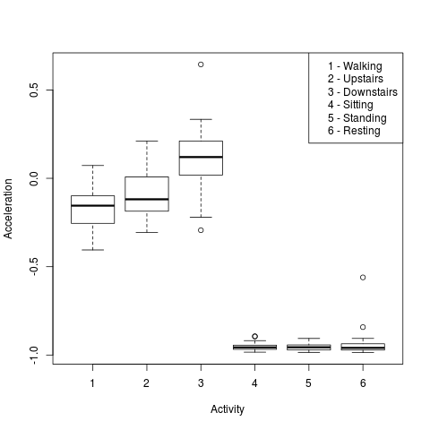

#Course project for Coursera Getting and Cleaning Data

This is the course project for Coursera [Getting and Cleaning 
Data](https://class.coursera.org/getdata-008/).

##Obtaining the Data

The data is located [here](https://d396qusza40orc.cloudfront.net/getdata%2Fprojectfiles%2FUCI%20HAR%20Dataset.zip). A full description of the how the
data is collected is located here: [Human Activity Recognition Using
Smartphones](http://archive.ics.uci.edu/ml/datasets/Human+Activity+Recognition+Using+Smartphones).

##Desired Output

The desired output is a table of 180 rows (30 subjects x 6 activities)
containing the average of all columns containing mean and standard deviation
values.

##Cleaning the Data

The R script _run_analysis.R_ performs the data cleanup through the
following steps:

+ read the training data, keeping only the columns containing mean()
and std() in the column names.
+ read the test data, keeping only the columns containing mean()
and std() in the column names.
+ concatenate the datasets
+ compute the average values of each column, grouped by subject and activity id
+ apply a human-friendly label and write the tidy dataset.

##Sanity Check

It is important to do some quick sanity checks on the data. We can plot
the mean acceleration per activity:

This shows the expected results:
+ There is more acceleration when walking than when stationary.
+ There is more acceleration when going upstairs than walking on level ground.
+ There is even more acceleration when going downstairs.

This is not an exhaustive test but the rough outlide gives us some 
confidence that the data has been properly loaded. The actual values
for acceleration deserve further investigation.

